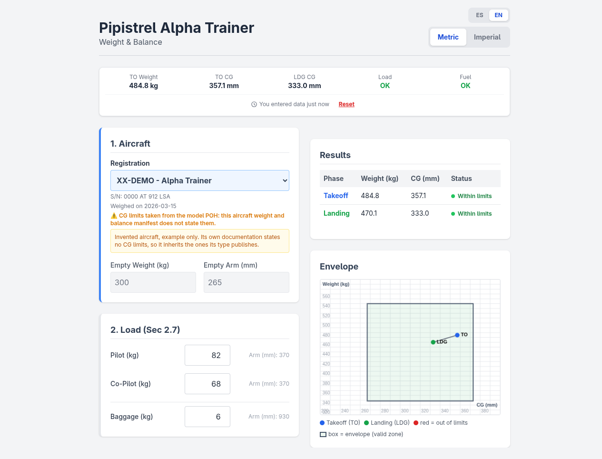

# Weight and Balance Calculator - Pipistrel ALPHA Trainer

[](https://github.com/carlosplanchon/weight-and-balance-calculator-piat/actions/workflows/tests.yml)


<sub>Pipistrel ALPHA Trainer in flight over Soriano, Uruguay. Photo by Agustín Gorostiaga, Aero Club Mercedes. © 2025 Agustín Gorostiaga, [CC BY 4.0](https://creativecommons.org/licenses/by/4.0/).</sub>

*Unofficial open-source project. Not affiliated with or endorsed by Pipistrel.
Always refer to current approved aircraft documentation for operational use.*

A self-contained, browser-based weight and balance calculator for the
**Pipistrel ALPHA Trainer** and **ALPHA Trainer PRO (LSA)**. It computes the
takeoff and landing CG, checks both against the envelope, models the fuel burn
between them, and reads each aircraft's empty weight, arm and CG limits from a
fleet file you provide.

---

> **IMPORTANT DISCLAIMER AND WARNING**
>
> This calculator is an **educational and demonstrational tool only**. **DO NOT USE IT FOR REAL-WORLD FLIGHT PLANNING.**
>
> **SAFETY WARNING**: misusing performance and weight and balance tools can contribute to accidents resulting in serious injury or death, and/or property damage.
>
> The calculations are based on the following documents:
> - **ALPHA Trainer**: POH-162-00-40-001, rev. A07
> - **ALPHA Trainer PRO**: POH-162-00-40-003, rev. B01
>
> Always consult the official and current **Pilot's Operating Handbook (POH)** for your specific aircraft, along with its **current weight and balance documentation**, for accurate and authoritative data. **Any question about applying these calculations, or about using this tool in a training context, should be directed to a qualified and properly rated flight instructor.**
>
> The author assumes no liability for any decision made or action taken based on the use of this tool.

---



<sub>Configured with the example fleet file. XX-DEMO is an invented aircraft: the figures are not those of any real airframe.</sub>

## Key Features

*   **Takeoff and landing CG:** both points are computed and checked against the envelope, with the fuel burn between them modelled explicitly.
*   **Per-aircraft data:** empty weight, arm and CG limits come from that aircraft's own approved documentation through an optional fleet file, not from a figure hardcoded for the type.
*   **Pending vs invalid:** a value not entered yet is never treated as a zero. Results stay hidden until the inputs that matter are present, so the calculator asks instead of guessing.
*   **Data age:** an empty weight without a weighing date is flagged as unverifiable, because it moves with every repaint, instrument change and periodic reweighing.
*   **Bilingual:** English and Spanish.
*   **Imperial and metric:** switchable, with the conversion leaving pending fields pending.
*   **Session persistence:** the last session is restored from localStorage and labelled with its age.
*   **Self-contained:** no build step, no server, no external production dependency. Every asset is vendored in `assets/`.

## Tech Stack

*   **HTML5** (semantic)
*   **[Tailwind CSS](https://tailwindcss.com/)** for the UI, built locally and vendored.
*   **[Alpine.js](https://alpinejs.dev/)** for reactivity and application logic.

## Running Locally

No build process is required.

```bash
git clone https://github.com/carlosplanchon/weight-and-balance-calculator-piat.git
cd weight-and-balance-calculator-piat
```

Then open `index.html` in your browser. To exercise the fleet file, serve the
directory over HTTP instead (browsers block `fetch` on `file://`):

```bash
python3 -m http.server 8000
# http://127.0.0.1:8000/index.html
```

## The fleet file (optional)

The calculator ships with the sample aircraft the handbooks publish, plus a
custom aircraft you fill in by hand. That is enough to use it.

To get **your own registrations** in the aircraft list, add
`datasets/fleet.json`:

```bash
cp datasets/fleet.example.json datasets/fleet.json
# then edit it with the figures from your aircraft
```

`datasets/fleet.example.json` documents every field. The short version:

| Field | Required | Notes |
| --- | --- | --- |
| `registration` | yes | Any non-empty string; shown in the aircraft list. |
| `type` | yes | `alpha_trainer` or `alpha_trainer_pro`. Selects the fallback CG limits. |
| `empty_weight` | yes | Both `kg` and `lbs`, and they have to agree. |
| `empty_arm` | yes | Both `mm` and `in`, and they have to agree. |
| `weighing_date` | recommended | Date of the report the figures come from. Left null, the interface flags the empty weight as unverifiable. |
| `cg_limits` | no | Declare them when that aircraft's documentation states its own; they win over the type's envelope. Left null, the aircraft inherits the type's and the interface says so. |
| `source_document` | no | Names the document the figures were taken from. Not read by the calculator; it is there for whoever maintains the file. |
| `serial_number`, `note` | no | Free text, shown with the aircraft. |

Two rules the file follows on purpose:

1. **The aircraft's own paperwork wins over the type's.** For a specific
   aircraft, its own current approved documentation is the authority: for the
   empty weight and arm, and for the CG limits as well. A handbook publishes the
   envelope of the *type*; equipment and modifications belong to one *airframe*,
   and what records them is that aircraft's own documentation, usually its
   weight and balance manifest and possibly an approved supplement. That is why
   `cg_limits` can be declared per aircraft, and why every entry names the
   document its figures were taken from.
2. **A bad entry is dropped, never repaired.** An entry that fails validation is
   skipped and the interface says how many were skipped. A file that cannot be
   read leaves the calculator usable and says so. Nothing silently falls back to
   a default.

`datasets/fleet.json` is gitignored. It describes real airframes and belongs to
whoever operates them, so it is deployment data, not code.

## Testing

The project has an in-browser test suite using **[QUnit](https://qunitjs.com/)**,
disabled by default. To run it, open `index.html` with the `?test=true`
parameter:

```
http://127.0.0.1:8000/index.html?test=true
```

Headless, the same way CI runs it:

```bash
./run_tests.sh
```

It serves the directory on an ephemeral port, loads the suite in headless
Chromium and exits non-zero if any assertion fails or the page never reports
results.

[VERIFICATION.md](VERIFICATION.md) records what has been checked, how, and what
that does and does not establish. It reports a mutation experiment measuring
what the suite would actually catch, and that experiment ships with the
repository rather than being quoted at you:

```bash
python3 verification/run_mutations.py
```

It introduces 39 deliberate defects one at a time and reports which part of the
suite catches each. The defects are in `verification/mutations.json` and the
recorded outcome in `verification/results.json`, which carries the SHA-256 of
the files it was measured over. CI checks that hash on every push, so a recorded
result cannot quietly drift away from the code it describes:

```bash
python3 verification/run_mutations.py --check   # milliseconds, not minutes
```

### What the suite covers

*   **POH source data** (sections 2.6, 2.7, 2.8 and 6.2): every constant in the
    code is written out again against the handbook it comes from, so editing a
    limit without editing the check fails the suite. Includes the section 6.2
    sample calculation, used as a published input/output reference.
*   **Deterministic grid sweeps** across the supported ranges and their
    boundaries, pinning down the *shape* of the calculation (conservation,
    monotonicity, identities) rather than single worked examples. Fixed spacing,
    no random seeds, so a failure always reproduces and the covered points are
    readable in the code.
*   **Fleet file**: format validation, rejection of malformed entries, the
    example file shipped here, and the behaviour when there is no fleet file at
    all.
*   **Persistence and units**: restoring a session, and the unit conversion
    leaving pending fields pending.

## Updating the vendored dependencies

Each dependency has a script that downloads it through npm (which verifies
sha512 integrity) and rewrites the references in `index.html`. None of them
commit anything.

```bash
./update_alpine.sh        # Alpine.js
./update_qunit.sh         # QUnit
./update_playwright.sh    # the CI Chromium pin
./generate_styles.sh      # rebuild assets/tailwind.css and stamp its hash
./run_tests.sh            # then check it is still green
```

## Related

**[Takeoff Performance Calculator](https://github.com/carlosplanchon/takeoff-performance-calculator-piat)**,
the sibling tool for the same aircraft. It estimates the ground roll and the
distance to clear a 50 ft obstacle from elevation, temperature, wind components
and runway surface, following the same handbook the figures here come from.

## Contributing

Contributions are welcome. If you find a bug or have a suggestion, open an
*Issue* or a *Pull Request*.

## License

The source code is distributed under the Apache License 2.0. See the `LICENSE`
file.

Two things in this repository are not covered by it. The photograph in
`assets/banner.jpg` is separately copyrighted and carries its own terms, and the
vendored dependencies in `assets/` keep theirs. Both are set out in
[THIRD_PARTY_NOTICES.md](THIRD_PARTY_NOTICES.md), which is where to look before
reusing either.

Pipistrel and Textron Aviation are trademarks of their respective holders.
No rights to those trademarks are granted by this project.

---
*Made with ♥️ in Dolores, Soriano, Uruguay.*
